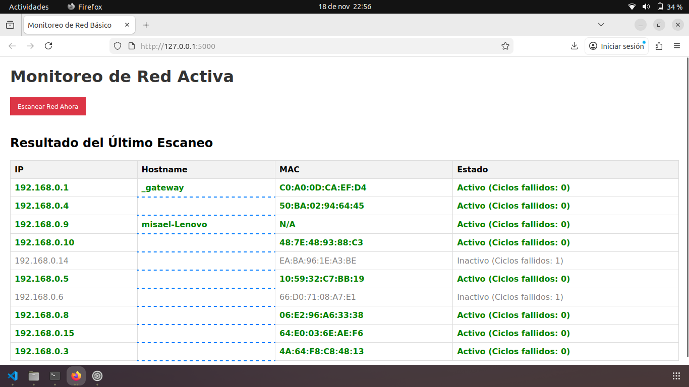
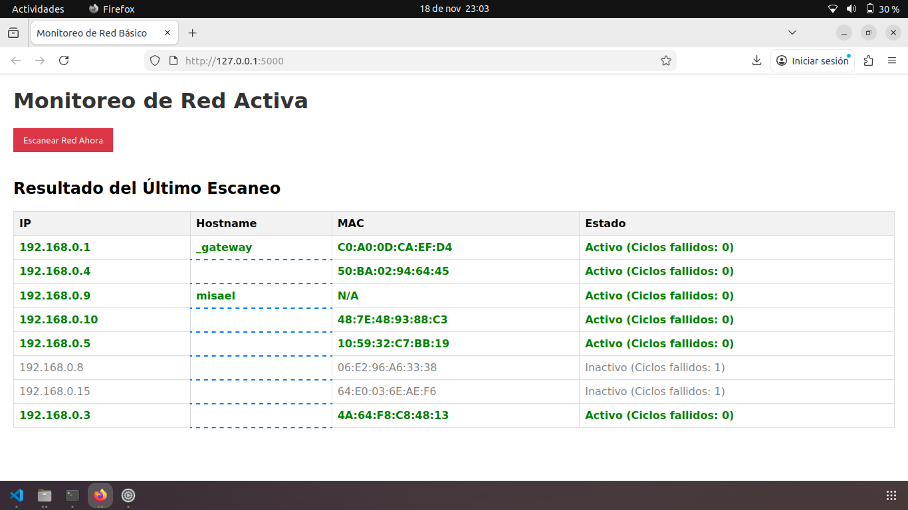

# Portada Institucional

## **Tecnológico Nacional de México**
### **Instituto Tecnológico de Ensenada**

---


 **Asignatura**         Administración de redes   
 **Docente**            Mario Cesar Medina Ortiz   
 **Actividad**          Proyecto / solucion edcaneo de redes   
 **Estudiante**         Misael Castillo Ríos   
 **Matrícula**          al19760561   
 **Grupo**              8SS   
 **Fecha**              18 de noviembre 2025   

---

# Monitor de Red Activa con Flask y Nmap

Este proyecto es un monitor de red simple desarrollado en **Python
(Flask)** para la interfaz web y **Nmap** para la detección de
dispositivos activos (host discovery).

------------------------------------------------------------------------

## Estructura del Proyecto

El proyecto está diseñado para ser ligero, utilizando solo unos pocos
archivos clave:

    net-monitor/
    ├── app.py              <-- Lógica principal
    ├── config_redes.txt    <-- Lista de redes en formato CIDR a escanear (ej: 192.168.1.0/24).
    └── estado_red.json     <-- Base de datos JSON guarda el estado (IP, MAC, Hostname) y colores (Verde/Gris).

------------------------------------------------------------------------

## Instalación y Requisitos (Ubuntu/Linux)

### 1. Requisitos del Sistema

Para que el sistema funcione correctamente ---incluyendo la detección de
**MAC** y **Hostname**--- es necesario tener **Nmap** instalado y
ejecutar el script con permisos de superusuario (`sudo`).

Instala las dependencias del sistema:

``` bash
sudo apt update
sudo apt install python3 python3-pip nmap
```

### 2. Dependencias de Python

Instala las librerías necesarias globalmente, para que el usuario root
(usado por sudo) pueda acceder a ellas:

``` bash
sudo pip install flask python-nmap
```

### 3. Configuración

Crea o edita el archivo **config_redes.txt** en la raíz del proyecto y
define las redes a escanear (una por línea):

    # Ejemplo de contenido de config_redes.txt
    192.168.0.0/26

------------------------------------------------------------------------

## Ejecución

Ejecuta el servidor web con:

``` bash
sudo python3 app.py
```

------------------------------------------------------------------------

## Uso

-   Abre tu navegador y ve a:\
    **http://127.0.0.1:5000/**

-   Presiona el botón **"Escanear Red Ahora"** para iniciar el
    escaneo y actualizar el estado de los dispositivos.

-   Haz clic en cualquier celda de la columna **Hostname** para editar y
    asignar un nombre personalizado a un dispositivo.

------------------------------------------------------------------------

## Detener

Para detener el monitor:

    Ctrl + C

------------------------------------------------------------------------

## Evidencia

Escaneo Inicial


Edición de Hostname

